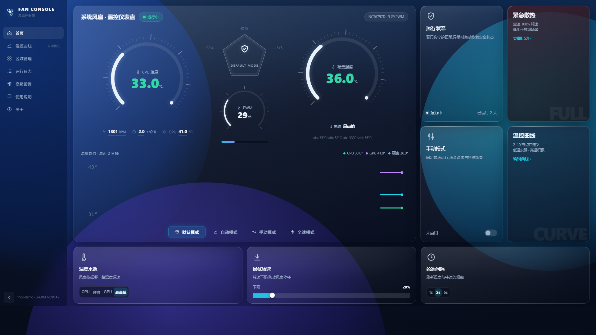
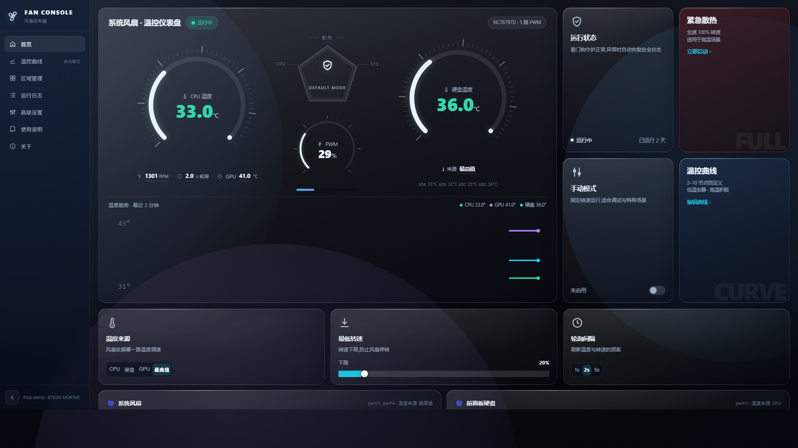
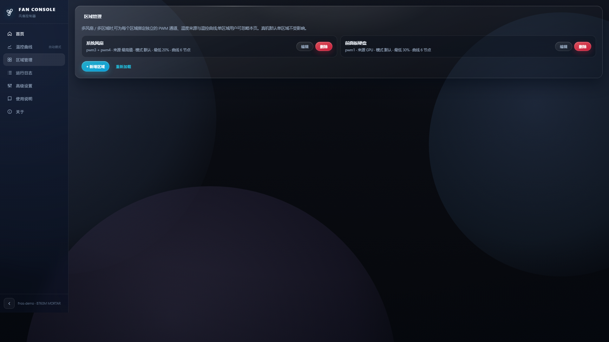
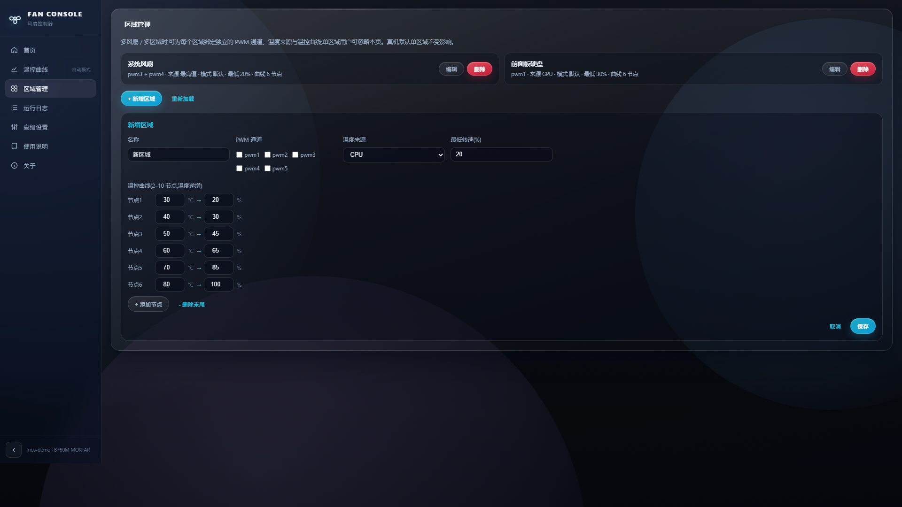
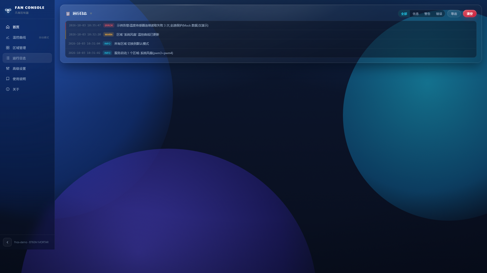
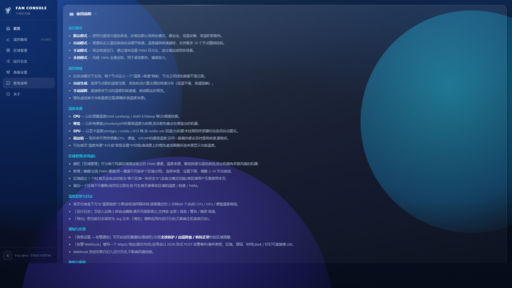
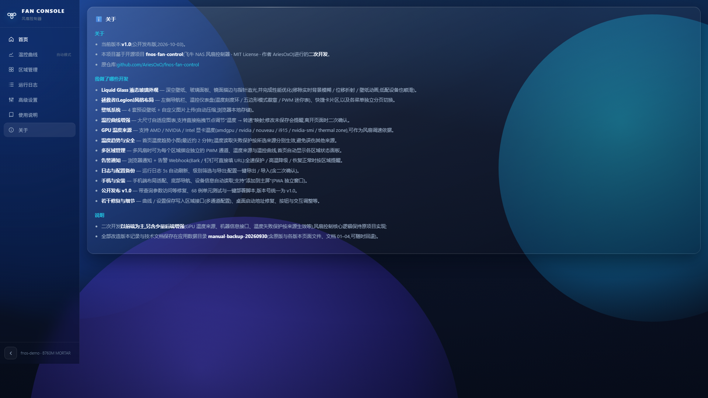
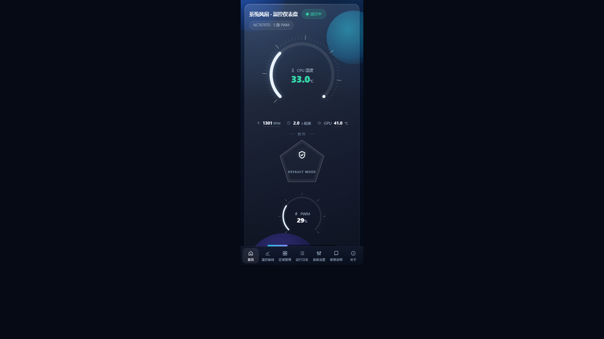
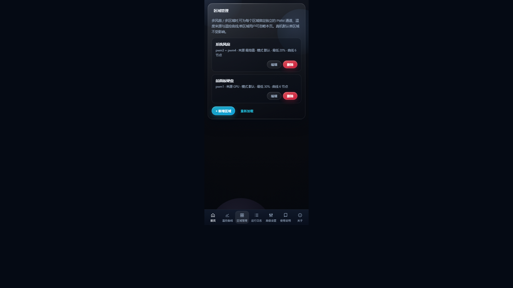
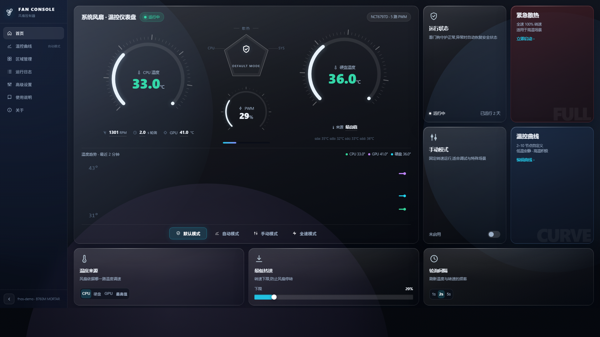

# 风扇控制器 · fnos-fan-control(v1.0 增强版)

> 飞牛 fnOS 风扇控制器的二次开发版本,基于 [AriesOxO/fnos-fan-control](https://github.com/AriesOxO/fnos-fan-control)(MIT License)改造。
> 以前端改造为主,并含少量后端增强(GPU 温度来源、失败保护按来源生效、告警 Webhook 等);核心风扇控制逻辑沿用上游实现。



## ✨ 功能亮点(v1.0)

- **Liquid Glass 液态玻璃界面** + 拯救者(Legion)风格布局:侧栏导航、温控仪表盘、五边形模式徽章;四套预设壁纸 + 自定义壁纸(浏览器本地存储);
- **温控曲线**:大尺寸自适应图表、节点拖拽调节、未保存提醒与离开页面确认;
- **温度来源**:CPU / 硬盘 / GPU(amdgpu / nvidia / nouveau / i915 / nvidia-smi / thermal zone)/ 最高值;
- **温度趋势小图**:首页展示最近约 2 分钟的 CPU / GPU / 硬盘温度曲线;
- **多区域管理**:多风扇可绑定独立 PWM 通道、温度来源与曲线,首页显示各区域状态卡;
- **告警通知**:浏览器通知 + 告警 Webhook(Bark / 钉钉可直接填 URL),全速保护 / 高温降级 / 恢复正常时提醒;
- **日志与备份**:运行日志自动刷新、级别筛选、导出;配置一键导出 / 导入(二次确认);
- **手机端**:窄屏布局适配、底部导航,支持 PWA“添加到主屏”;
- **质量保障**:68 例单元测试 + CI(组装断言 / 单测 / `node --check` / fpk 构建)。

## 🖼 界面预览(1920×1080 全屏截图)

| | |
| --- | --- |
|  |  |
|  |  |
|  |  |
|  |  |
|  |  |
|  |  |
|  |  |

## 📥 安装

1. 在 [Releases](../../releases) 页面下载 `fan-control_1.1.2.fpk`
   (产品版本 **v1.0**;fpk 版本号 `1.1.2` 承接上游 1.1.x 版本线,便于在应用中心覆盖升级);
2. 飞牛 fnOS 应用中心 → 手动安装 → 上传该 fpk;或 SSH 执行:

   ```bash
   appcenter-cli install-fpk fan-control_1.1.2.fpk
   ```

3. 安装向导中设置管理端口(默认 9511)与访问密码(留空 = 不启用认证)。

> 说明:实测 `appcenter-cli install-fpk` 在应用已安装时不会执行升级;已装旧版本的设备请在应用中心界面升级,或卸载后重装(卸载前请备份 `/vol1/@appconf/fan-control/`)。

## 🔧 从源码构建

```bash
# 1) 组装前端(基线 + 样式 → pipeline/index.html)
python pipeline/构建脚本/fc-assemble-legion.py

# 2) 单元测试(68 例,不依赖 sysfs)
python -m unittest discover -s tests

# 3) 生成 fpk(需要官方 fnpack:https://developer.fnnas.com/docs/cli/fnpack/)
cp pipeline/index.html src/app/bin/static/index.html
fnpack build -d src
```

本地界面预览(Mock 数据,无需 NAS):

```bash
python pipeline/构建脚本/fc-mock-server.py
# 打开 http://127.0.0.1:9377/;手机端预览 http://127.0.0.1:9377/phone
```

## 🆚 相对上游的改动

**修复**

- 带查询参数的访问入口不再误判 401(静态页 / API 全路由);
- 温度读取失败保护**按所选来源分别生效**(CPU / 硬盘 / GPU / 最高值互不误伤);
- 折叠面板长内容不再被 2000px 截断(手机端使用说明完整显示);
- 芯片显示名补全(Nuvoton NCT6791–6798、ITE 8xxx 等常见型号)。

**前端**

- 液态玻璃外观 / Legion 布局 / 壁纸系统(预设 + 自定义);
- 独立分页:首页 / 温控曲线 / 区域管理 / 运行日志 / 高级设置 / 使用说明 / 关于;
- 曲线拖拽 + 未保存提醒 + 离开确认;温度趋势小图;日志筛选与导出;配置导出导入;
- GPU 温度显示、告警通知设置、区域管理界面、PWA manifest 与图标。

**后端增强**

- GPU 温度来源(hwmon / nvidia-smi / thermal zone 多级回退);
- 机器信息接口(主机名 / 机型);
- `alert_webhook` 配置项 + 告警状态机(全速保护 / 降级 / 恢复时异步 POST,失败不阻塞主循环);
- PWA 静态资源免认证路由。

## 📂 目录结构

```
pipeline/            # 前端可复现管线(原始基线 + 样式 + 组装 / Mock 脚本)
src/                 # 飞牛 fpk 工程(manifest / cmd / config / wizard / app)
tests/               # 单元测试(68 例)
screenshots/         # 界面截图(Mock 数据)
```

## 🙏 致谢与许可

- 上游项目:[AriesOxO/fnos-fan-control](https://github.com/AriesOxO/fnos-fan-control)(MIT License);
- 本仓库基于其二次开发,保留原 [LICENSE](LICENSE) 与版权声明;改造部分同样以 MIT 协议开源;
- 免责声明:风扇调速涉及硬件,请在理解配置含义的前提下使用;因不当配置造成的硬件问题自行承担。
